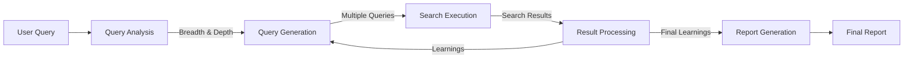

# System Patterns: Junior Researcher

## System Architecture

The Junior Researcher application follows a modular architecture with clear separation of concerns. The system is designed around a core research engine that coordinates various components to perform deep, multi-layered research. The UI is built with a modern, clean, and minimal design, utilizing a bluish color theme that is easy on the eyes.

```mermaid
flowchart TD
    User[User Input (CLI/Web)] --> Main[Main Application]
    Main --> QueryAnalysis[Query Analysis]
    Main --> ResearchEngine[Research Engine]
    Main --> ReportGeneration[Report Generation]
    
    QueryAnalysis --> ResearchEngine
    ResearchEngine --> ReportGeneration
    
    ResearchEngine --> QueryGeneration[Query Generation]
    ResearchEngine --> SearchExecution[Search Execution]
    ResearchEngine --> ResultProcessing[Result Processing]
    
    QueryGeneration --> SearchExecution
    SearchExecution --> ResultProcessing
    ResultProcessing --> |Feedback Loop| QueryGeneration
    
    subgraph Progress Tracking
        ResearchProgress[Research Progress Tracker]
    end
    
    ResearchEngine <--> ResearchProgress
```

## Key Components

### 1. Main Application (main.py)
- Entry point for the application.
- Handles command-line arguments and user interaction.
- Coordinates the overall research process.
- Manages environment variables and configuration.

### 2. Deep Research Engine (deep_research.py)
- Core component that implements the DeepSearch class.
- Manages the research process from query analysis to report generation.
- Interfaces with the Gemini API for various AI-powered tasks.
- Implements different research modes (fast, balanced, comprehensive).

### 3. Research Progress Tracker
- Implemented as the ResearchProgress class.
- Tracks the status of research queries and sub-queries.
- Maintains the research tree structure.
- Provides progress visualization and reporting.

## Key Technical Decisions

### 1. Tree-Based Research Structure
The application uses a tree-based structure to represent and track the research process. This allows for:
- Clear parent-child relationships between queries.
- Recursive deep diving in comprehensive mode.
- Effective progress tracking and visualization.
- Organized collection of learnings.

### 2. Concurrent Processing
The application uses asyncio for concurrent processing of multiple research queries, which:
- Significantly improves performance.
- Allows for broader research coverage.
- Efficiently utilizes API resources.
- Provides a better user experience with faster results.

### 3. Semantic Similarity Checking
To avoid redundant queries and ensure diverse research coverage, the application implements semantic similarity checking that:
- Compares potential queries for semantic overlap.
- Ensures each query explores a unique aspect of the topic.
- Improves the quality and breadth of research.
- Optimizes API usage by avoiding duplicate searches.

### 4. Adaptive Research Parameters
The application dynamically determines research parameters based on:
- Query complexity and scope.
- Selected research mode.
- Available resources.
- Previous research results.
- This adaptive approach ensures optimal research quality and efficiency.

## Design Patterns

### 1. Factory Pattern
The application uses factory-like methods to generate queries, follow-up questions, and reports based on different parameters and modes.

### 2. Strategy Pattern
Different research modes (fast, balanced, comprehensive) implement different strategies for conducting research, with varying depth, breadth, and recursion.

### 3. Observer Pattern
The progress tracking system observes and reports on the state of the research process, providing real-time updates to the user.

### 4. Composite Pattern
The research tree structure implements a composite pattern, with each node potentially containing child nodes (sub-queries).

## Data Flow



## Component Relationships

### Research Engine and Progress Tracker
The DeepSearch class works closely with the ResearchProgress class to:
- Track the status of each query.
- Maintain the research tree structure.
- Provide progress updates to the user.
- Collect and organize learnings from each query.

### Query Generation and Result Processing
These components form a feedback loop where:
- Initial queries are generated based on the user's input.
- Results are processed to extract learnings.
- New queries are generated based on these learnings.
- This cycle continues until the desired depth is reached.

### Search Execution and External APIs
The search functionality interfaces with Google's Gemini API to:
- Execute search queries.
- Process and extract information from search results.
- Format results with proper citations.
- Track visited URLs and sources.

## Deployment Model

The backend API is deployed directly using uvicorn without Docker containerization. The FastAPI server runs on port 8080, and it communicates with the frontend via REST API calls.
